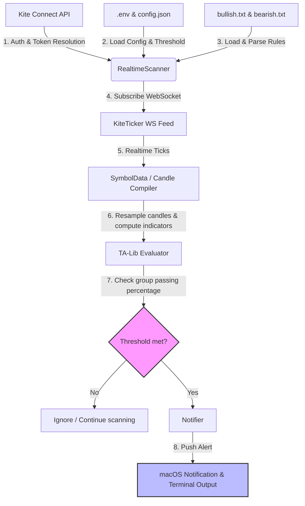

# Kite WebSocket Realtime Scanner (BasilTests)

A real-time technical analysis scanner built on top of **Kite Connect** and **TA-Lib**. The scanner subscribes to live stock market feeds via WebSockets, builds multi-interval candles (`1m`, `5m`, `15m`, `1h`, `4h`, `1d`) on-the-fly, evaluates sets of complex indicator conditions, and triggers threshold-based desktop notifications.

---

## Architecture & End-to-End Flow

Here is how the data flows through the application in real-time:



### Flow Step-by-Step:
1. **Startup & Resolution:** `scanner.py` reads `config.json` for target trading symbols (e.g. `NSE:RELIANCE`) and resolves them into numeric Kite `instrument_token`s.
2. **Historical Data Pre-fetch:** The scanner queries which intervals are needed by the active conditions (e.g. `5m`, `15m`, `1h`, `4h`, `1d`). It pre-fetches historical candles for each interval so that indicators (like MACD, Stochastic, or RSI) can be calculated immediately on the first tick.
3. **WebSocket Subscription:** The scanner establishes a connection via `KiteTicker` and subscribes to the full-depth ticks for all resolved symbols.
4. **Candle Compiling & Live Updates:** 
   * As ticks arrive, they are piped into `SymbolData`. 
   * It buckets ticks to form OHLC candles for active intervals.
   * The current forming candle is updated in real-time. The closing price is dynamically updated using the Last Traded Price (LTP), and the high/low values are adjusted if the LTP breaks the current range.
   * `4h` candles are resampled on-the-fly using `1h` candles.
5. **Grouped Condition Evaluation:** 
   * Every incoming tick updates candle OHLC and volume on the ingestion worker. Live chart events are published at most once per second per symbol (and immediately at candle rollover).
   * A separate worker evaluates private candle snapshots from `bullish.txt` and `bearish.txt`. Provisional evaluations for the same symbol/candle are combined; final snapshots from earlier candles are retained. The rule panel displays the evaluation timestamp separately from the latest market update.
   * Desktop alerts are suppressed for evaluations more than ten seconds behind exchange time. The health endpoint reports pending tick batches and evaluations for monitoring processing load.
   * It counts the percentage of rules that evaluate to `True`.
6. **Threshold-Based Alerts:** 
   * The scanner loads `ALERT_THRESHOLD` (e.g. `70` for 70%) from the `.env` file.
   * If the percentage of passing conditions $\ge$ `ALERT_THRESHOLD`, it triggers a grouped alert.
   * The alert lists exactly which conditions passed and the stock's current price.
7. **Cooldown Filter:** The notifier applies a cooldown (e.g., 5 minutes) using a stable `cooldown_key` so that flickering condition counts do not cause alert spam. Desktop notifications use Notification Center on macOS, Windows notifications on Windows, and `notify-send`/libnotify on Linux; terminal output remains available when desktop notifications are unavailable.
8. **Dynamic Configuration Reload:** Every 5 seconds, the scanner checks the modification timestamps of `bullish.txt`, `bearish.txt`, and `.env`. If files have changed, it reloads the conditions and `ALERT_THRESHOLD` on-the-fly without interrupting the live WebSocket connection.

---

## File Structure

* **`scanner.py`**: The central daemon process that connects to the WebSocket feed, manages historical data, aggregates candles, and runs the evaluation loop.
* **`conditions.py`**: Contains indicators utilizing `ta-lib` (e.g., MACD, RSI, ADX, Heikin-Ashi) and contains the natural-language condition parsers.
* **`notifier.py`**: Handles alert throttling (cooldowns) and triggers terminal printouts and macOS desktop notifications.
* **`../kite_runtime/auth.py`**: Shared Kite Connect authentication used by both Kite applications.
* **`test_parser.py`**: Unit tests verifying rule parsing and logic evaluation.
* **`config.json`**: List of symbols to track.
* **`nifty200_futures_underlyings.json`**: The 200 PDF reference underlyings.
* **`update_futures_symbols.py`**: Resolves those underlyings against Zerodha's live NFO instrument master and replaces `config.json` with exact near-month futures contracts. Run it after each monthly rollover.
* **`bullish.txt` / `bearish.txt`**: Plaintext files containing conditions to trigger alerts.

---

## Environment Setup & Installation

### 1. Prerequisites (macOS)
Since the python package `TA-Lib` depends on the underlying C-library `ta-lib`, you must install it first using Homebrew:
```bash
brew install ta-lib
```

### 2. Virtual Environment & Dependencies
From the parent `trading_alerts` directory, initialize your virtual environment and install the shared dependencies:
```bash
# Create virtual environment
python -m venv .venv

# Activate virtual environment
source .venv/bin/activate

# Install dependencies
pip install -r requirements.txt
```

---

## Configuration

### 1. Shared `.env` File
Configure the shared `trading_alerts/.env` file with the following variables:
```ini
KITE_API_KEY="your_api_key"
KITE_API_SECRET="your_api_secret"
KITE_ACCESS_TOKEN="your_access_token_after_auth"
ALERT_THRESHOLD=70
```

### 2. `config.json`
Define the list of symbols you wish to scan:
```json
{
  "symbols": [
    "NSE:RELIANCE",
    "NSE:INFY",
    "NSE:SBIN",
    "NSE:TCS"
  ]
}
```

---

## Usage

### One-command startup (recommended)

From `trading_alerts`, run:

```bash
.venv/bin/python -m kite_runtime kite
```

One-time setup: in your Kite developer app, set **Redirect URL** to
`http://127.0.0.1:8765/callback`. Run the command on the same computer as your
browser. Keep `KITE_API_KEY` and `KITE_API_SECRET` in the shared root `.env`.
The launcher checks the saved access token; if it has expired, it opens Zerodha
login and waits up to five minutes for the local callback. Complete the browser
login and app-code step yourself. The request token is captured automatically,
exchanged, and the access token saved to `.env` without displaying it.

The command starts only the Kite dashboard and its alert scanner. Open
`http://127.0.0.1:8000` for the dashboard. Do not also start `scanner.py`.
Ctrl+C stops Kite. A valid token is reused on subsequent starts. If a token
expires while running, stop and rerun the command.

To start MTF alerts separately, use `.venv/bin/python -m kite_runtime mtf`.
Both applications share authentication through the `kite_runtime/` package.
Options: `--login` to force login and `--port 8001` to change the dashboard port.
The callback remains on port 8765.
If you keep a different developer-app redirect URL, use `--manual-auth` to paste
the redirect URL; saving the access token and starting services are still automatic.


### Live candlestick strategy dashboard

The dashboard and alert scanner share the same KiteTicker connection, candle
store and condition evaluator. Start it from the `kite` directory:

```bash
../.venv/bin/uvicorn dashboard:app --host 127.0.0.1 --port 8000
```

Open `http://127.0.0.1:8000`. The selected symbol receives live OHLC updates
over the local WebSocket. The chart switches between every strategy timeframe:
5-minute (EMA 20/50 and optional VWAP), 15-minute (Heikin-Ashi EMA 5/9),
1-hour (EMA 9/50), and daily (EMA 9/50). Opening-range and previous-day levels
are optional layers. Markers are confirmed only after a 5-minute rollover; the
side panel shows the still-forming strategy state.

Stop with one Ctrl+C. Shutdown drains active requests, stops Kite reconnects,
closes the ticker on its reactor thread and cancels the session finalizer and
pending dashboard broadcasts. Ticker/startup-thread cleanup waits are bounded.
The split dashboard does not rebuild unused historical combined-score plots.
Run shutdown regression checks from `kite` with
`../.venv/bin/python -m unittest test_dashboard_shutdown.py test_live_dashboard.py`.

Kite supplies exact live VWAP through `average_price`. Its historical candle API
does not include VWAP, so pre-connection chart history uses a conventional
OHLC-volume reconstruction and switches to Kite's exact value on live ticks.

### 1. Authentication
To force a fresh login and start Kite, run from `trading_alerts`:
```bash
.venv/bin/python -m kite_runtime kite --login
```
Login captures the callback and saves `KITE_ACCESS_TOKEN` to the root `.env`
automatically. Add `--manual-auth` to paste a redirect URL or request token
if your developer app uses a different redirect URL.

### 2. Running the Scanner
To start the real-time scanning daemon:
```bash
python scanner.py
```

### 3. Running Unit Tests
To verify parsing and indicator evaluations:
```bash
python test_parser.py
```
# Chart timestamp contract

The dashboard uses two synchronized charts: candles and price overlays above,
and strategy component studies below. Select ADX (14), OBV with EMA (5), or
Range / 5×ATR on 5m; MACD on 15m; RSI on 1h/1D. The lower chart uses its own
indicator units. Combined rule counts remain in the sidebar and confirmed
signals remain on the candle chart. Panning and zooming synchronize both
panels; missing values retain timestamp placeholders to preserve alignment.

Validate the dashboard with `node kite/test_dashboard_ui.js`.

Chart timestamps are Unix seconds representing the original candle start instant;
the browser formats them explicitly in `Asia/Kolkata`, independently of its local
timezone. Daily candles display their trading date rather than a midnight trading
time. Historical API offsets are preserved when converting to market wall time.
KiteTicker's host-local naive datetimes are normalized at the SDK callback boundary.
No timestamp normalization changes OHLC values or aggregation rules.

The normal NSE equity session is 09:15–15:30 IST. Regular-session final starts are
15:25 (5m), 15:15 (15m), and 15:15 (1h); the final hourly interval is shortened
by the session close. These are normal-session conventions, not a holiday or
special-session calendar. Live candle construction excludes pre-open/post-close
updates and rejects out-of-order exchange ticks. The dashboard finalizes the last
observed candle at session close without constructing a synthetic candle; signals
are stored once per candle. Restart after upgrading to clear old in-memory
post-close candles and signals. Special trading sessions require an explicit
exchange calendar before use; feed connectivity alone does not mean market open.
